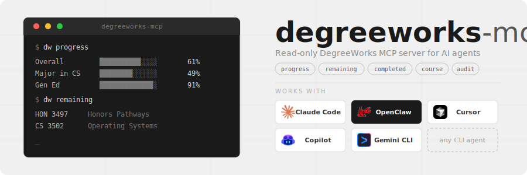

<div align="center">
  
</div>

<p align="center">
  <a href="https://pypi.org/project/degreeworks-cli/"></a>
  
  
  
  
</p>

**degreeworks-cli** gives any AI agent — Claude Code, Cursor, Copilot, Codex, anything that can run a command — strictly **read-only** access to a KSU student's DegreeWorks degree audit and course catalog. Degree progress, remaining requirements, completed courses with grades, and full course info with parsed prerequisites and scheduled sections. You stop clicking through DegreeWorks and start asking whether you're actually on track to graduate.

<p align="center"><em>Plans schedules good enough to pass advisor review<a href="#advisor-note">*</a>.</em></p>

## Set up in one message

Paste this into your AI agent:

```text
Fetch and follow the instructions from
https://raw.githubusercontent.com/Aaryan-Kapoor/degreeworks-cli/main/INSTALL_FOR_AGENTS.md
Set up degreeworks-cli for me end to end — install it, sign me in, and verify
it works. Then show me something useful about my degree progress and suggest
what I should ask next.
```

That's the whole setup. The agent installs the CLI, installs its own degreeworks skill, opens a browser for your normal KSU SSO login (it never sees your password — the CLI just captures a read-only session and auto-detects your degree), verifies everything with `dw doctor`, and finishes by pulling your real degree progress and suggesting what to ask first.

After that, your login refreshes itself: the CLI silently renews the session from your saved browser profile, so you'll rarely be asked to sign in again.

## Then just ask

> *"Am I actually on track to graduate on time?"*

> *"What courses do I still need, and which can I take next semester?"*

### Prompts worth stealing

The point of an agent is autonomy — don't ask for data, ask for outcomes. Copy these:

**Plan the next two semesters**

```text
Plan my next two semesters. Pull my full audit first, ask me for my constraints
(target credit load, days I can't be on campus, campus preference, graduation
target), then verify every candidate course with `dw course` for prereqs,
offering term, and open sections before drafting a conflict-free schedule.
Present it with a CRN table, rationale, risks, and fallbacks.
```

**Am I on track to graduate?**

```text
Am I actually on track to graduate by my target date? Pull my progress and
remaining requirements, map out how many terms of what credit load it takes to
finish, and flag any bottleneck — a course only offered every other term, a long
prereq chain, or a requirement I keep deferring.
```

**The fastest path to graduation**

```text
What's the fastest realistic path to graduation given my remaining requirements?
Account for prerequisite chains and which courses are actually offered when.
Give me a term-by-term plan and tell me the minimum number of semesters.
```

**Audit my completed courses**

```text
Audit my completed courses against my degree requirements. For each requirement
block, show what's satisfied, what's in progress, and what's still open — and
flag any completed course that didn't apply where I'd expect it to.
```

**The one-course deep dive**

```text
I'm considering CS 4720 next term. Check its prerequisites against what I've
completed, tell me whether I'm eligible, and list every scheduled section with
days, times, campus, instructor, and open seats.
```

## How it works

1. **Your agent runs `dw`** — a small Python CLI that talks to DegreeWorks' own student API. Every call is a GET; the client has no POST/PUT/DELETE methods, so the tool physically cannot register, drop, or change anything.
2. **Auth is your normal browser login.** `dw login` opens a real browser to KSU SSO, you sign in like always, and the CLI captures the short-lived session cookies. The auth token expires roughly every 90 minutes, but the CLI silently refreshes it from your saved browser session — you sign in about once per device, not once per class.
3. **The agent carries a skill.** The bundled skill (`dw skill install`) teaches any agent the commands, the read-only rules, and a deterministic **8-phase schedule-planning protocol**, so a brand-new session plans reliably instead of hallucinating prereqs.

## Manual setup (no agent)

```bash
pipx install "degreeworks-cli[login]"
dw login          # browser opens — log in with KSU SSO
dw progress       # how close to graduation?
```

No pipx? Use `python -m pip install --user "degreeworks-cli[login]"` (on Windows: `py -m pip install --user "degreeworks-cli[login]"`) and make sure Python's user scripts directory is on your PATH — pip prints its exact location in a warning if it isn't.

`dw login` uses Playwright's bundled Chromium if present, and automatically falls back to your installed Chrome or Edge — so no 150 MB browser download is required on most machines.

## Commands

```
dw [--json | --md] <command>

Setup:
  doctor                    Diagnose install/PATH/auth/API state + next step
  skill install DIR         Install the bundled agent skill

Identity:
  login [--headless]        Browser-based KSU SSO login (cookies captured)
  whoami                    Student identity + token expiry

Academics:
  progress                  % to graduation, per-requirement progress bars
  remaining                 Every course still needed, grouped by requirement
  completed [--transfers]   Completed + in-progress courses, grouped by term
  audit                     Full degree-audit tree with per-rule status
  course DISCIPLINE NUMBER  Description, parsed prereqs, scheduled sections

AI snapshot:
  dump [--shallow]          Full academic snapshot (best paired with --md)
```

Output is human tables by default, `--json` for machines, `--md` for AI consumption — put the flag before the command: `dw --md course CS 3305`.

## For agent developers

- `AGENTS.md` at the repo root is the standing instruction file picked up by Claude Code, Cursor, Copilot, Codex, Windsurf, Aider, and friends — it holds the full 8-phase schedule-planning protocol.
- `dw skill install <dir>` emits the bundled portable skill (SKILL.md + references) into any skill system — no repo checkout needed.
- `dw --json doctor` reports every setup check with a `next_step` command, so agents never guess state.
- Every command is machine-readable with `--json`; `dw --md dump` is the one-shot full-context snapshot.

## Configuration

Config lives in `~/.degreeworks/` (all auto-populated during `dw login`):

- `cookies.txt` — session cookies (keep private)
- `config.json` — auto-detected `school` / `degree` / `audit_type`
- `browser_profile/` — Playwright's persistent SSO session (powers silent refresh)

Override any value per-run with `DEGREEWORKS_SCHOOL`, `DEGREEWORKS_DEGREE`, `DEGREEWORKS_AUDIT_TYPE`.

## Scope

Currently wired to `degreeworks.kennesaw.edu`. DegreeWorks is an Ellucian product used by many universities — generalizing to other schools by making the base URL configurable is possible but not done yet. If you're at another school and want this to work, open an issue.

## Strictly read-only

Every API call this tool makes is a GET. It cannot register or drop courses, modify the audit, or change anything in DegreeWorks — by design, not by policy. The `DegreeworksClient` class has no method other than `_get()`, `get_audit()`, and `get_course()`. Your agent gets eyes, not hands. Any plan it produces is advisory — confirm with your academic advisor and register through Owl Express.

## License

MIT — see [LICENSE](LICENSE).

## Disclaimer

This is a personal project and is not affiliated with, endorsed by, or associated with Ellucian, DegreeWorks, or Kennesaw State University. Just something I built for myself and thought was worth sharing.

---

<a name="advisor-note"></a>
<sub>* A Spring/Fall 2026 semester plan generated using this tool together with Claude Opus in Claude Code was reviewed and approved by a KSU academic advisor. The advisor was not affiliated with this project and was not informed that the plan was AI-generated; it was presented as my own work. This note exists to share a real-world validation signal and does not imply any endorsement by the advisor or the university. — Aaryan Kapoor</sub>
